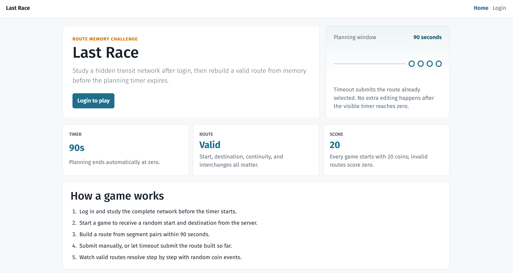
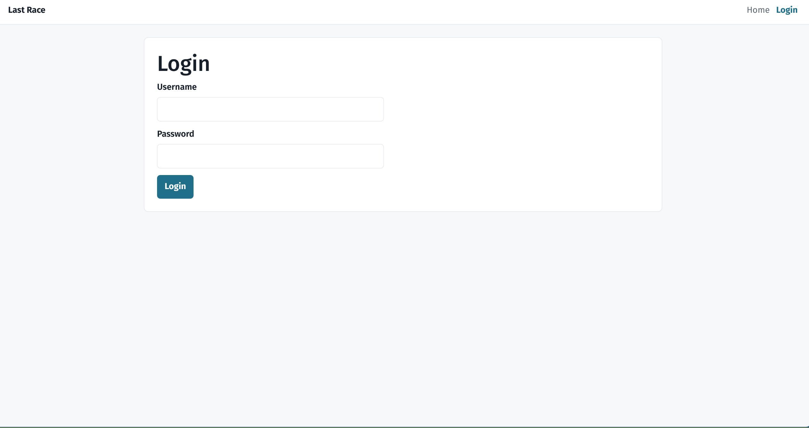
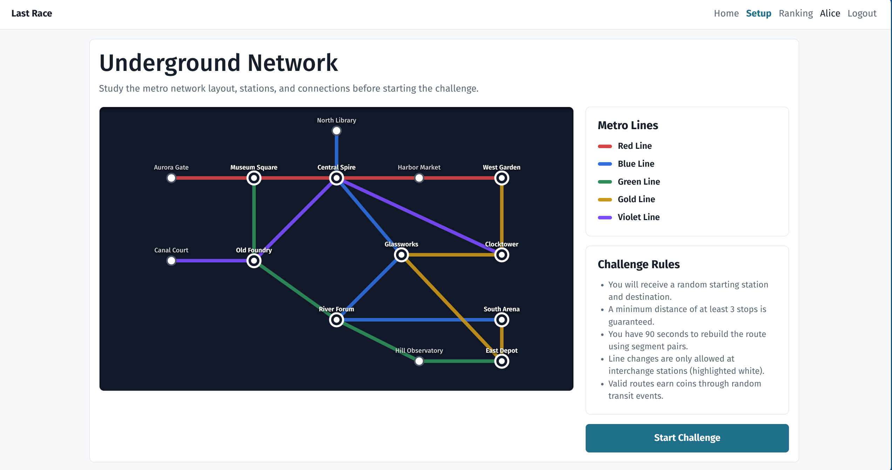
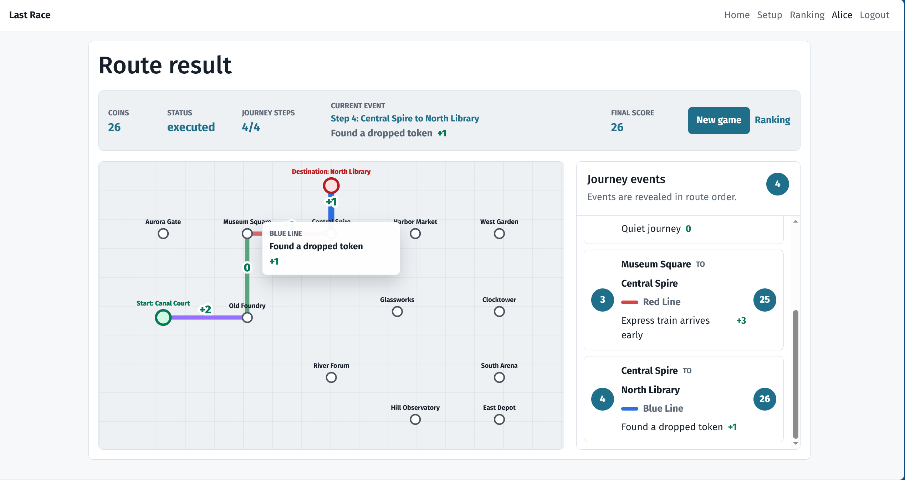
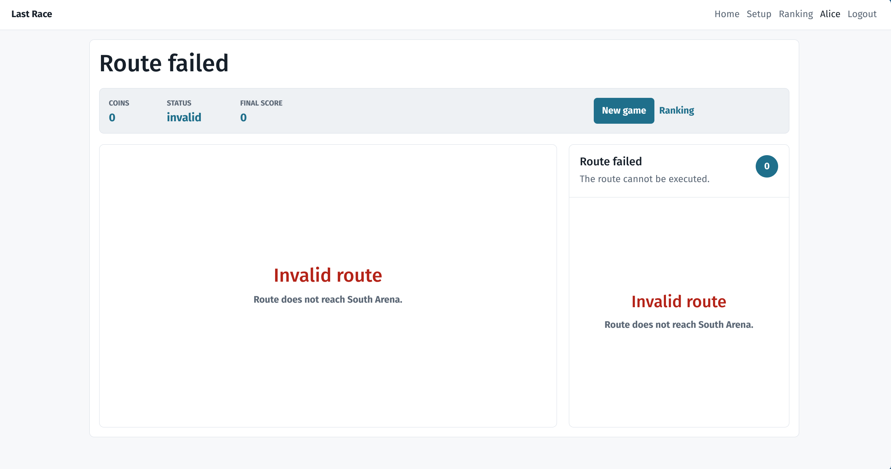

# Last Race

## Student

- Name: Van-Thanh Nguyen
- ID: s336748

## Project Summary

Last Race is a single-player route-planning game. A registered player studies a
metro network, receives a random start and destination, and has 90 seconds to
select an ordered route from station-pair segments. The server validates the
route, resolves the line used for each step, applies random events, stores the
score, and exposes a protected ranking.

Anonymous visitors can only read the game instructions. They cannot see the
network map, segment list, ranking, or game pages.

## How to Run

Install and start the server:

```sh
cd server
npm install
npm run db:reset
nodemon index.js
```

If `nodemon` is not available, use:

```sh
cd server
npm start
```

Install and start the client:

```sh
cd client
npm install
npm run dev
```

Default development URLs:

- Client: `http://localhost:5173`
- Server API: `http://localhost:3001/api`
- Debug Swagger UI: `http://localhost:3001/docs`, only when the server runs with
  `DEBUG_MODE=1` or `npm run debug`

## Debug Mode

Run the backend with debug tools enabled:

```sh
cd server
npm run debug
```

Debug mode enables:

- `/docs` Swagger UI for API exploration;
- detailed `[game-validation]` server logs for route validation decisions.

To authenticate in Swagger UI, run `POST /api/sessions` first with one of the
seeded users. The browser stores the `connect.sid` session cookie, and protected
"Try it out" requests reuse that cookie.

## Users Credentials


| User   | Username | Password   | Notes                                     |
| ------ | -------- | ---------- | ----------------------------------------- |
| Alice  | `user1`  | `password` | Seeded with one historical game, score 21 |
| Bianca | `user2`  | `password` | Seeded with one historical game, score 24 |
| Carlo  | `user3`  | `password` | No historical score initially             |

After `npm run db:reset`, the ranking already contains Bianca and Alice.

## React Client Application Routes


| Route                     | Access              | Purpose                                                                                                     |
| ------------------------- | ------------------- | ----------------------------------------------------------------------------------------------------------- |
| `/`                       | Public              | Instructions page. Does not expose the network map or station data.                                         |
| `/login`                  | Public              | Login form for seeded registered users.                                                                     |
| `/setup`                  | Authenticated       | Full network study screen and start-game action.                                                            |
| `/game/:gameId/planning`  | Authenticated owner | Timed route-planning game screen, route builder, submit confirmation, and result playback after submission. |
| `/game/:gameId/execution` | Authenticated owner | Compatibility route that redirects to the result screen.                                                    |
| `/game/:gameId/result`    | Authenticated owner | Reloads a completed game result.                                                                            |
| `/ranking`                | Authenticated       | Best-score ranking for users with completed games.                                                          |
| `/404`                    | Public              | Not-found page.                                                                                             |

## API Server

All protected endpoints require the Passport session cookie created by
`POST /api/sessions`.


| Method   | Endpoint                      | Auth       | Description                                                                                            |
| -------- | ----------------------------- | ---------- | ------------------------------------------------------------------------------------------------------ |
| `GET`    | `/api/health`                 | No         | Returns`{ "status": "ok" }`.                                                                           |
| `POST`   | `/api/sessions`               | No         | Login with`{ "username", "password" }`; creates the session cookie.                                    |
| `GET`    | `/api/sessions/current`       | Yes        | Returns the logged-in user.                                                                            |
| `DELETE` | `/api/sessions/current`       | Yes        | Logs out and destroys the session.                                                                     |
| `GET`    | `/api/network/setup`          | Yes        | Returns full network data for the setup screen.                                                        |
| `POST`   | `/api/games`                  | Yes        | Creates a planning game with random eligible start/destination.                                        |
| `GET`    | `/api/games/:gameId/planning` | Yes, owner | Returns station-only planning data, segment pairs, deadline, and assigned stations.                    |
| `POST`   | `/api/games/:gameId/route`    | Yes, owner | Submits`{ "segmentIds": [...] }`, validates the route, applies events if valid, and stores the result. |
| `GET`    | `/api/games/:gameId/result`   | Yes, owner | Returns a completed invalid, expired, or executed game result.                                         |
| `GET`    | `/api/ranking`                | Yes        | Returns best score and completed game count per user.                                                  |

Important status codes:

- `401`: missing or expired session;
- `403`: game belongs to another user;
- `404`: game not found;
- `409`: game is not in the required state, for example already submitted;
- `422`: malformed route payload such as non-integer `segmentIds`.

## Database Tables

- `users`: registered users with username, display name, password hash, and
  salt.
- `stations`: fixed station names and map coordinates.
- `metro_lines`: fixed line names and colors.
- `segments`: undirected direct station pairs.
- `line_segments`: association between metro lines and physical segments.
- `events`: random event descriptions and coin effects from `-4` to `+4`.
- `games`: one row per game, including owner, status, start/destination,
  deadline, submission time, score, and invalid reason.
- `game_steps`: persisted executed route steps with direction, resolved line,
  selected event, and coins after the step.

## Main React Components

- `AppRouter`: declares public and protected SPA routes.
- `AuthProvider`: restores and stores current session state.
- `ProtectedRoute`: redirects anonymous visitors away from registered-user
  screens.
- `TopNav`: shared navigation and logout action.
- `InstructionsPage`: public game instructions with no private network data.
- `LoginPage`: controlled login form.
- `SetupPage` and `NetworkMap`: complete protected network study screen.
- `PlanningPage`: timed route builder, route submit confirmation, auto-submit,
  invalid-result display, and valid-result playback.
- `StationOnlyMap`: planning/result map with station labels, selected segments,
  and animated route highlights.
- `SegmentList`: selectable station-pair list.
- `CountdownTimer`: visible 90-second planning countdown.
- `ExecutionTimeline`, `ScorePanel`, and `ResultRouteMap`: result playback and
  event/score display.
- `RankingPage` and `RankingTable`: protected ranking view.
- `SubmitButton`, `LoadingPanel`, `ErrorBanner`, and `EmptyState`: reusable UI
  controls and feedback states.

## Main Backend Modules

- `server/src/app.js`: Express middleware, Passport/session wiring, route
  mounting, debug docs, and error handlers.
- `server/src/features/auth/*`: Passport local strategy, login/logout/current
  session routes, user DAO, and password verification.
- `server/src/features/network/*`: protected setup-network API.
- `server/src/features/games/*`: game creation, graph selection, route
  validation, scoring, transactions, and result loading.
- `server/src/features/ranking/*`: ranking query and mapper.
- `server/src/db/*`: SQLite schema, connection, and seed data.
- `server/src/docs/*`: debug-only OpenAPI/Swagger documentation.

## Game Rules Implemented

- Setup shows the full network only to authenticated users.
- Planning hides line paths/colors but shows station names and direct segment
  pairs.
- The server assigns start and destination at least 3 stops apart.
- The visible timer is 90 seconds.
- Timeout submits the route built so far.
- The backend accepts submissions within `PLANING_TOLERANCE_SECONDS` after the
  deadline to absorb network delay; this tolerance is not shown as extra player
  time.
- A valid route must start at the assigned start, end at the assigned
  destination, be ordered continuously, and change lines only at interchange
  stations.
- Valid route validation returns the resolved `lineId` for each step.
- Valid routes receive one random event per step.
- Invalid or expired routes score 0 and insert no game steps.
- Ranking shows each user's best completed score.

## Screenshot

### Instructions



### Login



### Setup



### Planning


### Valid Result



### Invalid Result



### Ranking


## Use of AI Tools

AI assistance was used to draft and refine implementation plans, code, design
documents, debugging notes, and verification checklists. All generated changes
were reviewed against the project requirements.
