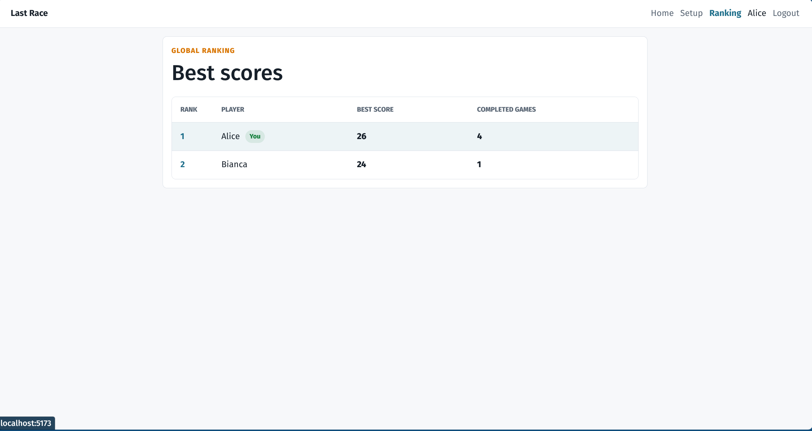
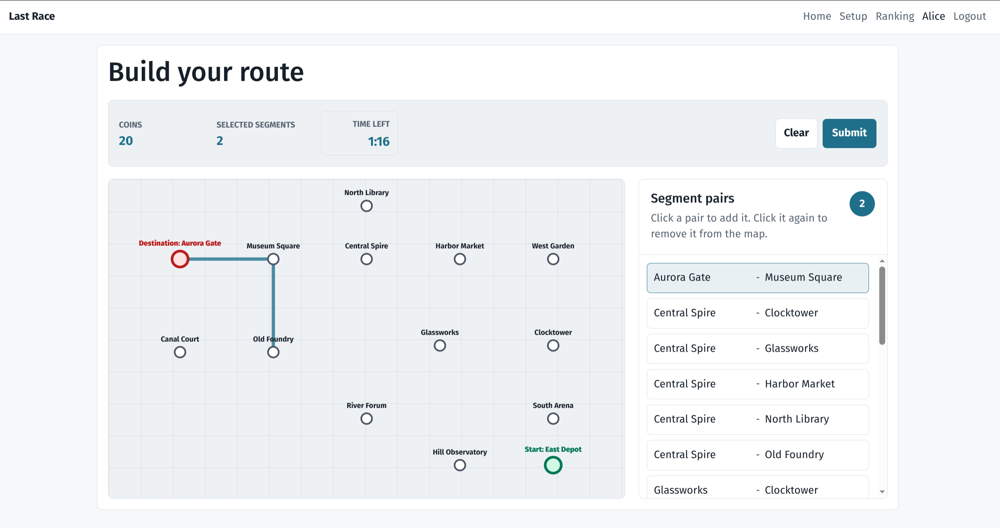

# Exam #1: "Last Race"

## Student: s336748 NGUYEN VAN-THANH

## React Client Application Routes

- Route `/`: public instructions page. Anonymous visitors can read the game rules but cannot see the network map, ranking, or game data.
- Route `/login`: login page for registered users. It contains a controlled username/password form.
- Route `/setup`: protected setup page. It shows the complete underground network with stations, connections, metro lines, and the button to start a game.
- Route `/game/:gameId/planning`: protected game page for the owner of `gameId`. It shows the station-only map, assigned start/destination, segment list, countdown timer, route selection, and route submission.
- Route `/game/:gameId/execution`: compatibility route for `gameId`. It redirects to the result page because execution playback is handled there.
- Route `/game/:gameId/result`: protected result page for the owner of `gameId`. It shows invalid, expired, or executed game results and reloads completed game data from the server.
- Route `/ranking`: protected general ranking page. It shows the best completed score for each ranked user.
- Route `*`: not-found page for unknown client-side routes.

## API Server

- GET `/api/health`

  - request parameters: none
  - response body: `{ "status": "ok" }`
- POST `/api/sessions`

  - request body: `{ "username": string, "password": string }`
  - response body: the logged user object `{ "id", "username", "name" }`; the response also creates the Passport session cookie
- GET `/api/sessions/current`

  - request parameters: session cookie
  - response body: current logged user object `{ "id", "username", "name" }`
- DELETE `/api/sessions/current`

  - request parameters: session cookie
  - response body: none; the current session is destroyed
- GET `/api/network/setup`

  - request parameters: session cookie
  - response body: complete setup network with stations, metro lines, colors, and ordered line segments
- POST `/api/games`

  - request parameters: session cookie
  - response body: new planning game with `gameId`, assigned start station, destination station, initial coins, planning deadline, and server time
- GET `/api/games/:gameId/planning`

  - request parameters: `gameId` path parameter and session cookie
  - response body: owned planning game data with station-only map data, all selectable segments, assigned start/destination, initial coins, planning deadline, and server time
- POST `/api/games/:gameId/route`

  - request parameters: `gameId` path parameter and session cookie
  - request body: `{ "segmentIds": number[] }`, where each id is a selected physical segment in route order
  - response body: valid execution result with resolved steps and events, or invalid/expired result with score `0`
- GET `/api/games/:gameId/result`

  - request parameters: `gameId` path parameter and session cookie
  - response body: completed game result, including persisted steps when the route was valid
- GET `/api/ranking`

  - request parameters: session cookie
  - response body: ranking rows with position, user id, username, display name, best score, and completed game count

## Database Tables

- Table `users` - contains registered users, display names, usernames, salted password hashes, and salts.
- Table `stations` - contains the fixed station names and coordinates used to draw the maps.
- Table `metro_lines` - contains fixed metro line names and colors.
- Table `segments` - contains undirected direct station pairs; each physical connection is stored once.
- Table `line_segments` - contains which metro line serves each segment and the segment order within that line.
- Table `events` - contains random event descriptions and coin effects between `-4` and `+4`.
- Table `games` - contains each game attempt, owner, status, start station, destination station, deadline, submission time, score, and invalid reason.
- Table `game_steps` - contains persisted executed steps for valid games, including direction, resolved line, selected event, and coins after the step.

## Main React Components

- `AppRouter` (in `client/src/router/AppRouter.jsx`): defines the SPA routes and applies protected-route wrappers.
- `ProtectedRoute` (in `client/src/router/ProtectedRoute.jsx`): prevents anonymous users from opening registered-user pages.
- `AuthProvider` (in `client/src/context/AuthContext.jsx`): restores the current session and stores login/logout state.
- `TopNav` (in `client/src/components/layout/TopNav.jsx`): shared navigation bar with login, setup, ranking, and logout actions.
- `InstructionsPage` (in `client/src/routes/public/InstructionsPage.jsx`): public instructions screen without private network data.
- `LoginPage` (in `client/src/routes/auth/LoginPage.jsx`): controlled login form and authentication error handling.
- `SetupPage` (in `client/src/routes/game/SetupPage.jsx`): protected setup screen that loads the full network and starts a new game.
- `NetworkMap` (in `client/src/components/game/NetworkMap.jsx`): draws the full colored network for the setup phase.
- `PlanningPage` (in `client/src/routes/game/PlanningPage.jsx`): timed route-building screen with segment selection, confirmation modal, timeout submit, and navigation to result.
- `StationOnlyMap` (in `client/src/components/game/StationOnlyMap.jsx`): draws station labels and selected route links without exposing line connections during planning.
- `SegmentList` (in `client/src/components/game/SegmentList.jsx`): displays all selectable station-pair segments and toggles selected segments.
- `CountdownTimer` (in `client/src/components/game/CountdownTimer.jsx`): displays the 90-second planning countdown using server time synchronization.
- `ResultPage` (in `client/src/routes/game/ResultPage.jsx`): displays valid, invalid, or expired game results and can reload persisted completed games.
- `ResultRouteMap` (in `client/src/components/game/ResultRouteMap.jsx`): displays the traveled route with resolved line colors during result playback.
- `ExecutionTimeline` (in `client/src/components/game/ExecutionTimeline.jsx`): lists executed steps, events, effects, and coin totals.
- `ScorePanel` (in `client/src/components/game/ScorePanel.jsx`): shows current coins, final score, and active event information.
- `RankingPage` (in `client/src/routes/ranking/RankingPage.jsx`): loads and displays the protected ranking.
- `RankingTable` (in `client/src/components/ranking/RankingTable.jsx`): renders ranking rows and highlights the logged user.

## Screenshot

General ranking page:

During a game:

## Users Credentials

- `user1`, `password` - seeded user with a previous successful game.
- `user2`, `password` - seeded user with a previous successful game.
- `user3`, `password` - seeded user without an initial ranking score.

## Use of AI Tools

AI tools used during the project were Codex, GPT, and Gemini. Given the
overall application structure, overall design, and big project layout. The AI
tools helped write and refine detailed design documents from each requirement,
then helped implement and debug the code phase by phase. The AI output was
reviewed and refined in each phase to meet the expected behavior and stay
aligned with the exam description.
